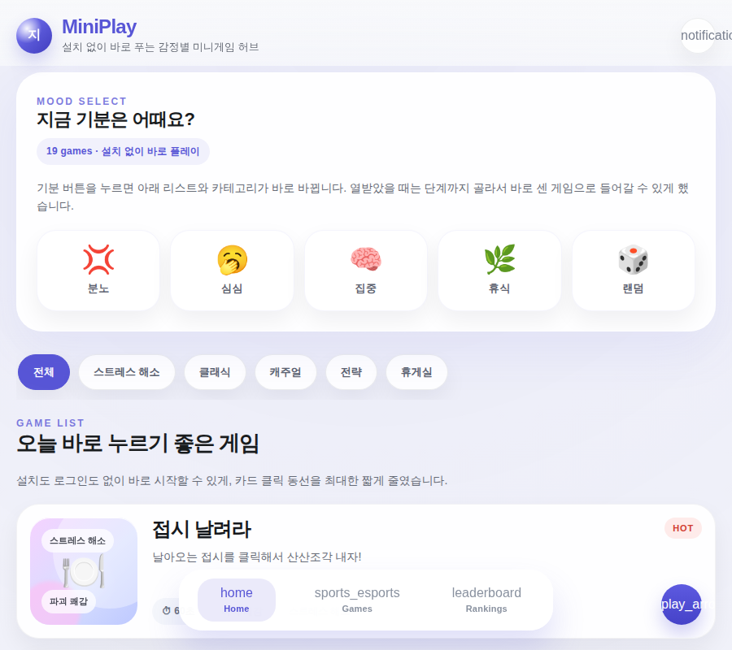
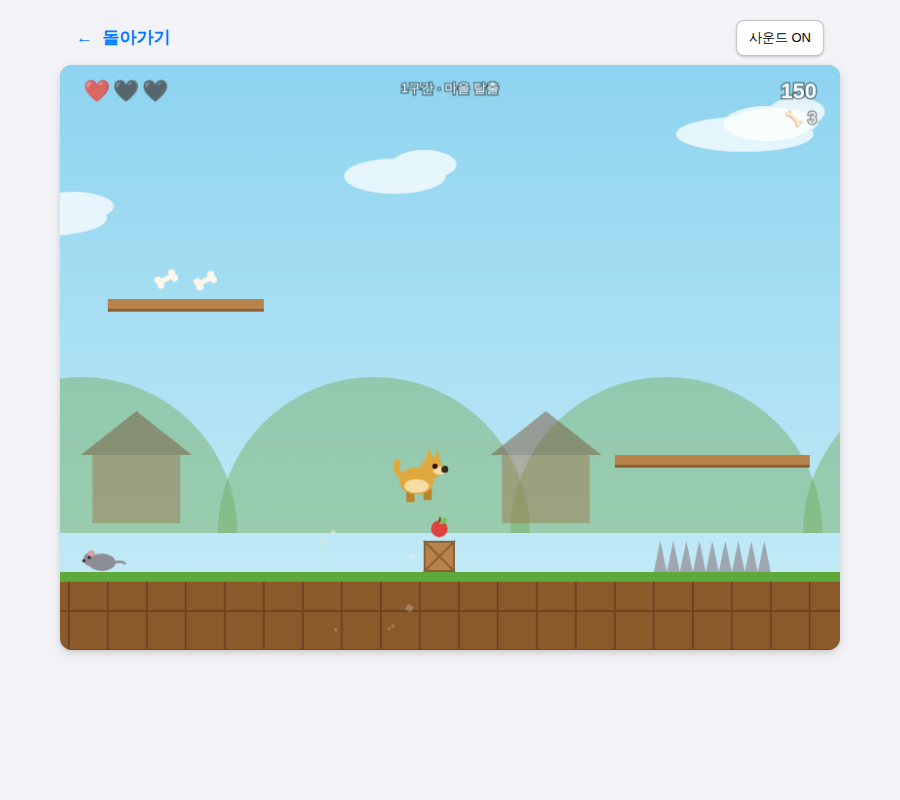
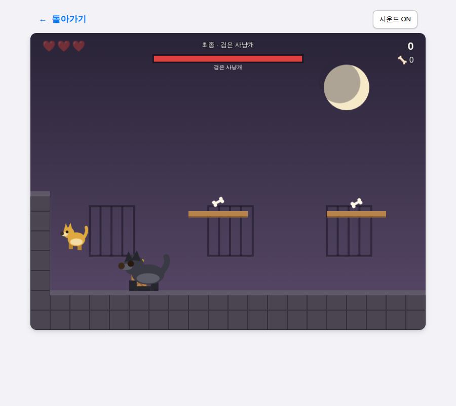
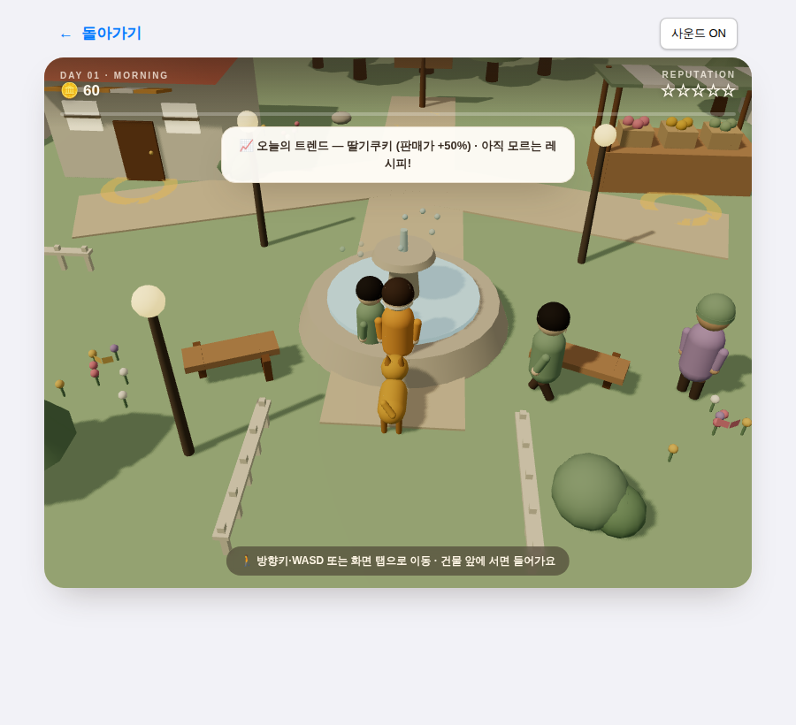
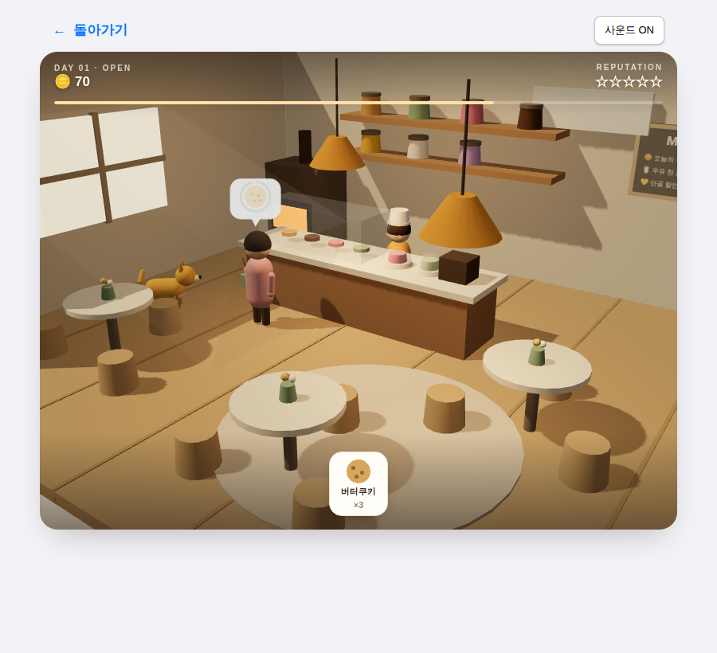

# 🎮 MiniPlay — 감정별 미니게임 허브

> 설치도 로그인도 없이, 브라우저에서 바로 즐기는 **20가지 미니게임**

**▶ 바로 플레이 → https://happyru120.github.io/mini-game/**

<p align="center">
  
</p>

지금 기분(분노 · 심심 · 집중 · 휴식)을 고르면 어울리는 게임을 추천해주는 정적 웹 게임 허브입니다.
프레임워크 없이 순수 HTML + Canvas + WebGL로 만들었고, 모든 게임이 외부 CDN 의존성 없이 자체 완결로 동작합니다.

---

## ✨ 스포트라이트

### 🐕 황구의 모험 — 횡스크롤 액션 플랫포머

고전 명작 플랫포머의 감성을 담은 오리지널 게임. 누렁이 황구가 잡혀간 친구들을 구하러 달립니다.

<p align="center">
  
  
</p>

- **3개 구간**: 마을 탈출 → 달리는 기차 지붕 → 검은 사냥개 보스전
- 적 밟기 처치, 폭탄·사과 주워 던지기, 뼈다귀 수집(20개마다 하트 회복)
- 체크포인트, 가변 점프(짧게/길게), 코요테 타임 등 정교한 플랫포머 물리
- 조작: `←→` 이동 · `Space/↑` 점프 · `X/Z` 던지기 · 모바일 터치 버튼 지원

### 🍪 쿠키샵 3D — 감성 베이커리 경영 시뮬레이션

Three.js로 만든 로우폴리 3D 경영 게임. 마을을 직접 돌아다니며 재료를 모으고, 나만의 레시피로 손님을 사로잡으세요.

<p align="center">
  
  
</p>

- **걸어다니는 3D 마을**: 베이커 캐릭터를 조작해 마켓 · 쿠키샵 · 탐험 숲을 방문 (황구가 뒤를 졸졸 따라다녀요)
- **레시피 발견 시스템**: 재료 3개를 조합해 숨겨진 레시피 10종을 찾아내는 재미
- **실시간 서빙**: 손님의 주문 말풍선과 인내심 게이지를 보며 알맞은 쿠키를 서빙
- **30일 시즌제**: 매일 바뀌는 트렌드 메뉴, 황구 탐험(희귀 재료), 평판 별 5개를 모으면 명예의 전당
- 돌아다니는 NPC 주민, 나비, 굴뚝 연기, 분수 등 살아있는 마을 연출 + 프로시저럴 로파이 BGM

---

## 🕹️ 전체 게임 목록

| 카테고리 | 게임 |
|---|---|
| 🔥 스트레스 해소 | 접시 날려라 · 스트레스볼 연타 · 분노의 타이핑 · 버블랩 터뜨리기 · 종이 찢기 · 상사한테 던지기 · 퇴근 도장 난사 · 알림 청소기 |
| 🧱 클래식 | 테트리스 · 스네이크 · 스페이스 슈터 · **황구의 모험** |
| 🃏 캐주얼 | 카드 뒤집기 · 가위바위보+ · 행운의 룰렛 |
| 🏰 전략 | 타워 디펜스 · 자원 관리자 · **쿠키샵 3D** |
| 🚬 휴게실 | 흡연 구역 · 고암항아리 |

---

## 🛠️ 기술 구성

- **순수 웹 스택** — 프레임워크/빌드 도구 없이 HTML + CSS + ES Modules
- **공용 게임 엔진** (`shared/engine/`) — 고정 60fps 게임 루프, 입력 매니저, 파티클, 화면 흔들림, 프로시저럴 사운드(WebAudio, 사운드 파일 0개)
- **3D 렌더링** — Three.js를 `shared/vendor/`에 내장(vendoring)해 CDN 없이 WebGL 구동
- **기록 시스템** (`shared/ui/RecordSystem.js`) — 회원가입 없이 닉네임 기반 로컬 랭킹
- **모바일 대응** — 터치 조작, 반응형 캔버스

```
mini-game/
├── index.html          # 게임 허브 (기분별 추천 + 카테고리)
├── games/<game>/       # 게임별 자체 완결 index.html (20종)
├── shared/
│   ├── engine/         # 공용 게임 엔진 모듈
│   ├── ui/             # 랭킹/기록 UI
│   ├── styles/         # 공통 스타일
│   └── vendor/         # three.js (self-hosted)
└── docs/               # 기획/디자인 문서, 스크린샷
```

## 🚀 로컬 실행

```bash
git clone https://github.com/happyru120/mini-game.git
cd mini-game
python3 -m http.server 8000   # 또는 npx serve
# → http://localhost:8000
```

> ES 모듈을 사용하므로 `file://`로 직접 열지 말고 로컬 서버를 통해 열어주세요.
